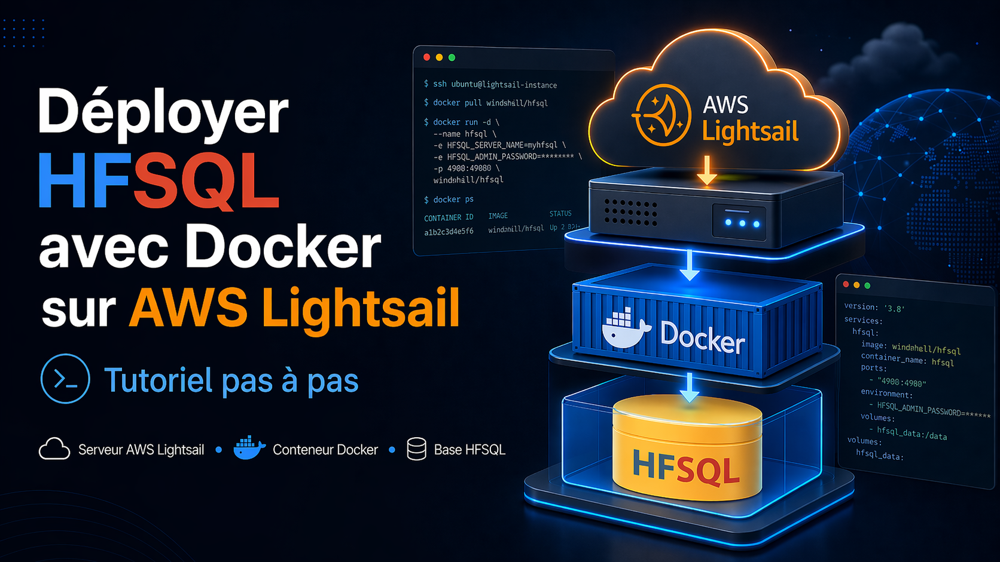

# Déployer [HFSQL](https://pcsoft.fr/accueilpub/hfsql.htm) sur [AWS Lightsail](https://aws.amazon.com/fr/lightsail/) avec [Docker](https://www.docker.com/) (pour 4€/mois)

Guide pas à pas pour créer une instance Ubuntu, installer Docker automatiquement via un launch script et publier un serveur HFSQL persistant.


## Objectif du guide

- Créer une instance Lightsail Ubuntu.
- Installer Docker automatiquement via un launch script.
- Déployer un conteneur HFSQL prêt à l’emploi.
- Conserver les données sur le disque de l’instance pour éviter toute
  perte lors d’un redémarrage.

## Contexte et prérequis

Ce tutoriel montre comment déployer un serveur HFSQL dans un conteneur Docker sur AWS Lightsail. Le déroulé reste volontairement simple : l’objectif est d’obtenir un serveur prêt à l’emploi sans manipulation
Linux avancée.

[PC SOFT](https://pcsoft.fr) met à disposition des images Docker HFSQL prêtes à l’emploi. Les deux ESN spécialisées [WinDev](https://windev.fr) du  [Groupe Tokamax](https://tokamax.com),  [CODE LINE](https://codeline.fr) et [SERIAL CODERS](https://serialcoders.fr), les utilisent depuis plusieurs années pour des serveurs [GDS](https://doc.pcsoft.fr/fr-FR/?2038001) et pour des bases de données clientes. Le scénario présenté ici convient bien à un environnement de test, de recette, à un GDS ou à une petite base HFSQL. Pour des besoins plus importants, il suffit d’augmenter la taille de l’instance.

Le guide suppose que vous disposez déjà d’un [compte AWS](https://aws.amazon.com/fr/account/) et des [droits nécessaires](https://docs.aws.amazon.com/fr_fr/lightsail/latest/userguide/amazon-lightsail-managing-access-for-an-iam-user.html) pour créer une instance Lightsail.

## Avertissements

- Ce document est fourni à des fins pédagogiques.
- Vérifiez votre configuration réseau et vos règles de firewall avant
  une mise en production.
- Adaptez le mot de passe, le port et les permissions de stockage à vos
  contraintes de sécurité.
- Les coûts Lightsail, les snapshots et les options réseau peuvent
  évoluer : contrôlez toujours la console AWS avant validation.

## Variables à adapter dans le script

- **HFSQL_IMAGE_VERSION** — Version de l’image Docker HFSQL*. Exemple :  `312009`
- **HFSQL_EXTERNAL_PORT** — Port exposé sur Lightsail. Exemple :  `4900`
- **HFSQL_PASSWORD** — Mot de passe administrateur HFSQL. Exemple :  `fds546d.fsg4\\8`
- **HFSQL_CONTAINER_NAME** — Nom du conteneur Docker. Exemple :  `HFSQL`
- **HFSQL_DATA_DIR** — Dossier de stockage sur l’hôte. Exemple :  `/home/docker/bdd_hfsql`

*La liste complète des versions HFSQL proposées sous forme de conteneur Docker est disponible sur [Docker Hub windev/hfsql tags](https://hub.docker.com/r/windev/hfsql/tags).

_________________________________________________________________

## Étape 1 — Ouvrir le module [Lightsail](https://aws.amazon.com/fr/lightsail/) sur AMAZON AWS et lancer la création de l’instance


Depuis la console AWS, ouvrez le module Lightsail. La liste des éventuelles instances existantes s’affiche. Cliquez ensuite sur Create instance pour démarrer la création du futur serveur HFSQL.

| 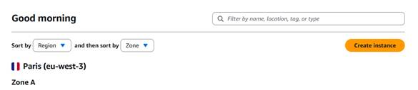 | 
:--- |

_________________________________________________________________

## Étape 2 — Choisir la zone, Ubuntu 24.04 et ajouter le launch script


La zone de création de l’instance apparaît. Ajustez au besoin la région et la zone de disponibilité.

|  |
:--- |


Choisissez une instance de type Linux, puis « Operating System only », puis Ubuntu 24.04.

| 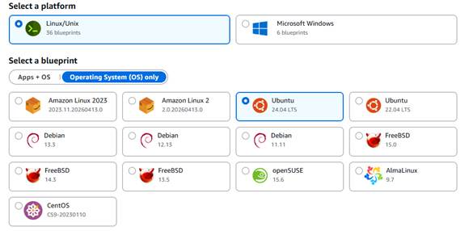 |
:--- |


Dans la partie Optional, cliquez sur Add launch script.

|  |
:--- |

Collez le script fourni à la fin de ce tutoriel.

**Renseignez immédiatement le mot de passe HFSQL dans la variable**
**HFSQL_PASSWORD. Si cette variable reste vide, le conteneur ne démarrera**
**pas.**

Autre point utile : l’image Docker HFSQL ne dispose pas d’un tag latest exploitable. Il faut donc fixer une version précise dans **HFSQL_IMAGE_VERSION** dès le départ (voir [Docker Hub windev/hfsql tags](https://hub.docker.com/r/windev/hfsql/tags).

| 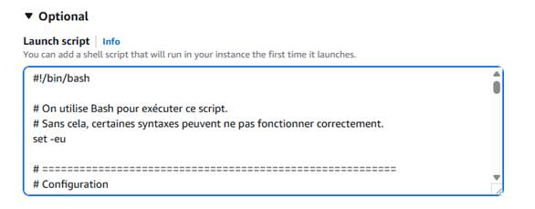 |
:--- |

> **Attention**
>
> - Le script est conçu pour Ubuntu. Si vous choisissez une autre  distribution, adaptez-le.
> - **HFSQL_PASSWORD** ne doit pas être vide.

_________________________________________________________________

## Étape 3 — Activer les snapshots si besoin, choisir la taille et créer l’instance

Lightsail peut prendre des snapshots automatiques de l’instance. Cette option est pratique pour revenir rapidement en arrière ou cloner un environnement de test, même si elle n’est pas indispensable pour un premier déploiement.

| 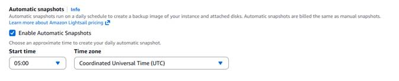 |
:--- |

Choisissez ensuite la taille de l’instance. Pour un GDS ou une petite base HFSQL, le premier niveau de gamme est souvent suffisant pour un usage à coût maîtrisé.

| 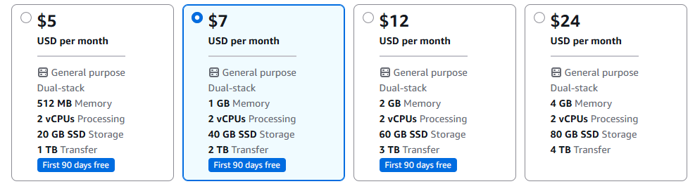 |
:--- |

Renseignez enfin le nom de l’instance puis lancez sa création.

| 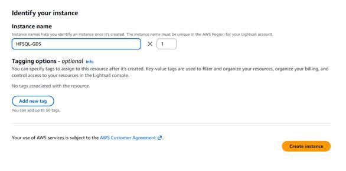 |
:--- |

_________________________________________________________________

## Étape 4 — Pendant l’installation, passer dans Networking et nettoyer le firewall

Dès que l’instance apparaît comme créée, son adresse IP publique devient visible. À ce stade, le serveur existe déjà, mais la sécurité réseau doit encore être ajustée.

| 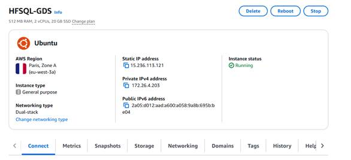 |
:--- |

Passez dans l’onglet Networking pour revoir les règles de firewall.

| 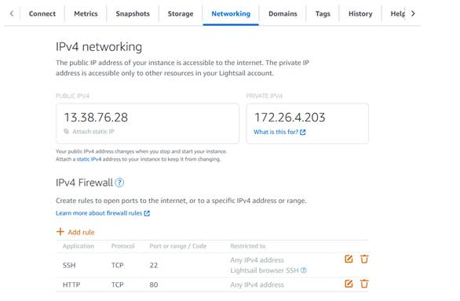 |
:--- |

Par défaut, le port 22 est utile pour SSH : conservez-le. Le port 80 apparaît souvent dans la configuration initiale ; si vous n’en avez pas besoin, vous pouvez le retirer ici.

_________________________________________________________________

## Étape 5 — Ouvrir le port HFSQL

Ajoutez ensuite une règle Custom / TCP correspondant au port externe défini dans le script, 4900 dans l’exemple ci-dessous.

| 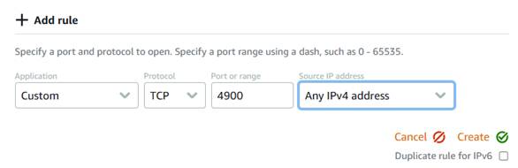 |
:--- |


> **Bon réflexe sécurité**
>
> - Any IPv4 address convient pour un tutoriel ou un test rapide.
> - En production, limitez la règle à vos IP autorisées.
> - Si HFSQL_EXTERNAL_PORT a été modifié dans le script, ouvrez ce même
  port sur le firewall Lightsail.
  
| 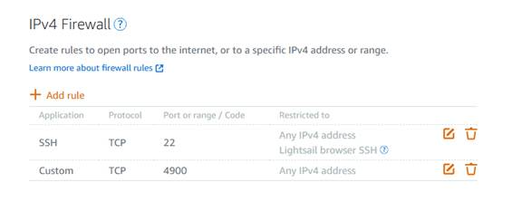 |
:--- |

_________________________________________________________________

## Étape 6 — Attacher une IP statique

Par défaut, l’adresse IP publique d’une instance Lightsail peut changer après un arrêt, un redémarrage ou une recréation du serveur. Pour disposer d’une adresse stable, attachez une IP statique.

| 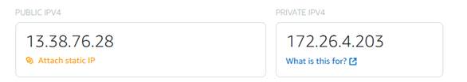 |
:--- |

Donnez un nom à l’adresse IP puis validez l’association.

| 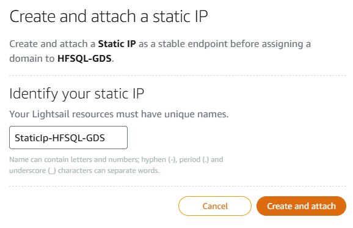 |
:--- |

Une fois l’IP statique attachée, vous pouvez l’utiliser telle quelle ou lui associer un nom DNS (pratique pour accéder à son serveur en utilisant *hfsql.acme.com*)

| 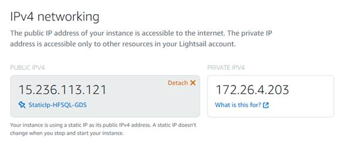 |
:--- |
_________________________________________________________________

## Étape 7 — Vérifier le déploiement depuis la console SSH

*Vérification optionnelle : à ce stade, le serveur HFSQL est probablement*
*déjà en cours d’exécution.*

Ouvrez l’onglet Connect puis cliquez sur Connect using SSH. Cela ouvre la console navigateur de Lightsail.

| 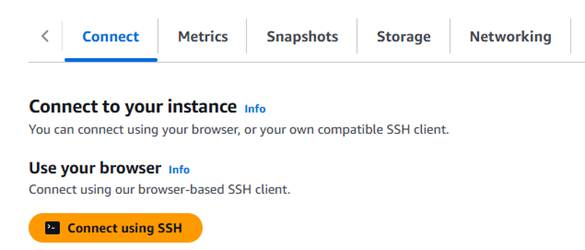 |
:--- |

Première vérification utile : attendez la fin du launch script, puis affichez les conteneurs Docker actifs.

Si la configuration réseau a été très rapide, il est possible que le script d’installation soit encore en cours d’exécution. Dans ce cas, attendez encore quelques instants avant de relancer les vérifications.

Pour diagnostiquer un démarrage plus difficile, gardez ces commandes sous la main : 
cat /var/log/cloud-init-output.log, 
sudo systemctl status docker et 
sudo docker logs HFSQL.

```bash
cloud-init status
sudo docker ps
```

_________________________________________________________________

## Étape 8 — Tester la connexion distante avec le Centre de contrôle HFSQL

Le serveur est maintenant prêt. Ouvrez le Centre de contrôle HFSQL puis renseignez l’adresse IP statique — ou votre nom DNS —, le port choisi et le mot de passe défini dans la variable HFSQL_PASSWORD du script.

| 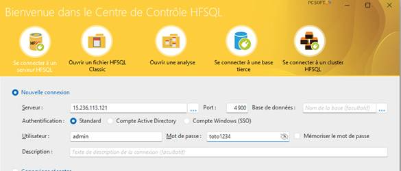 |
:--- |

Une fois la connexion établie, vous pouvez créer une base GDS, restaurer une base existante ou connecter directement une application WinDev.

Le tableau de bord confirme que le serveur HFSQL est bien opérationnel.

| 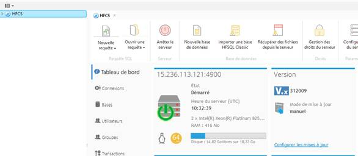 |
:--- |

_________________________________________________________________

## Points d’attention indispensables

### 1. Persistance des données

Le script utilise un bind mount entre le dossier hôte /home/docker/bdd_hfsql et le dossier /var/lib/hfsql dans le conteneur. Concrètement, les données de la base sont écrites sur le disque de
l’instance Lightsail et non dans une couche éphémère du conteneur.

- Un simple docker stop suivi d’un docker start ne fait pas perdre les
  données.
- Un redémarrage de l’instance Lightsail ne fait pas perdre les données.
- Si le conteneur est recréé, conservez le même montage pour retrouver
  les bases.

### 2. Sécurité

- Utiliser un mot de passe fort avant toute exposition sur Internet.
- Restreindre le firewall dès que possible au lieu d’utiliser Any IPv4 address, sauf en cas d’usage public assumé.
- Le chmod -R 777 du script facilite le premier déploiement, mais il est recommandé de durcir ces permissions en production.

### 3. Sauvegarde et restauration

Les snapshots Lightsail sont pratiques pour revenir rapidement à un état antérieur ou dupliquer un environnement, mais ils ne remplacent pas une politique de sauvegarde applicative et une rétention adaptée à vos obligations.

### 4. Débogage rapide

- cloud-init status --wait : attend la fin complète du script de lancement.
- cat /var/log/cloud-init-output.log : affiche le détail de l’exécution du script.
- sudo docker ps -a : liste les conteneurs, même arrêtés.
- sudo docker logs HFSQL : affiche les logs du serveur HFSQL.
- sudo systemctl status docker : contrôle l’état du service Docker.

_________________________________________________________________

## Annexe — Script de déploiement commenté

Le script ci-dessous est la version utilisée dans ce tutoriel.
*Beaucoup de  commentaires pour rester compréhensible (on est dans un tutoriel)*

> **Avant de lancer l’instance**
>
> - Remplacez **HFSQL_PASSWORD** par un mot de passe fort.
> - Vérifiez la valeur de **HFSQL_IMAGE_VERSION** (voir [Docker Hub windev/hfsql tags](https://hub.docker.com/r/windev/hfsql/tags))
> - Adaptez le port si vous ne souhaitez pas exposer le 4900.

**La cerise sur le gâteau : ce script est utilisable sur n'importe quelle machine Ubuntu.**

<!-- -->

```bash
#!/bin/bash
# On utilise Bash pour exécuter ce script.
# Sans cela, certaines syntaxes peuvent ne pas fonctionner correctement.
set -eu

# =========================================================
# Configuration
# =========================================================

# Nom du dépôt Docker contenant l'image HFSQL.
HFSQL_IMAGE_REPO="windev/hfsql"

# Version précise de l'image Docker HFSQL à utiliser.
# Il n'existe pas forcément de tag "latest" exploitable pour cette image.
# Liste des images mise à disposition par PC SOFT : 
# https://hub.docker.com/r/windev/hfsql/tags
HFSQL_IMAGE_VERSION="312009"

# Nom du conteneur Docker qui sera créé sur le serveur.
HFSQL_CONTAINER_NAME="HFSQL"

# Port exposé sur le serveur.
# C'est ce port que les clients utiliseront depuis l'extérieur.
HFSQL_EXTERNAL_PORT="4900"

# Port utilisé à l'intérieur du conteneur.
# Ici, HFSQL écoute sur le port 4900.
HFSQL_INTERNAL_PORT="4900"

# Mot de passe administrateur transmis au conteneur au démarrage.
##########################################################################
# IMPORTANT : Si le mot de passe est vide, le container ne démarrera pas #
##########################################################################
HFSQL_PASSWORD=""

# Dossier de stockage des données sur la machine hôte.
# Les fichiers de la base seront conservés ici.
HFSQL_DATA_DIR="/home/docker/bdd_hfsql"

# Dossier de données utilisé à l'intérieur du conteneur.
# Ce chemin a été identifié via "docker inspect".
HFSQL_CONTAINER_DATA_DIR="/var/lib/hfsql"

# Emplacement local de la clé GPG officielle de Docker.
# Cette clé permet à APT de vérifier l'authenticité des paquets Docker.
DOCKER_APT_GPG_KEY="/etc/apt/keyrings/docker.asc"

# Fichier qui contiendra la déclaration du dépôt APT Docker.
DOCKER_APT_SOURCE_FILE="/etc/apt/sources.list.d/docker.sources"

# Politique de redémarrage du conteneur.
# "unless-stopped" signifie :
# - le conteneur redémarre automatiquement après reboot
# - sauf si on l'a arrêté volontairement
DOCKER_RESTART_POLICY="unless-stopped"

# =========================================================
# Variables dérivées
# =========================================================
# Construit le nom complet de l'image Docker.
# Exemple : windev/hfsql:312009
HFSQL_IMAGE="${HFSQL_IMAGE_REPO}:${HFSQL_IMAGE_VERSION}"

# Demande à Ubuntu/Debian de ne poser aucune question interactive
# pendant l'installation des paquets.
export DEBIAN_FRONTEND=noninteractive

# =========================================================
# Installation de Docker
# =========================================================
# Met à jour la liste des paquets disponibles sur le serveur.
apt-get update -y

# Installe les paquets de base nécessaires :
# - ca-certificates : certificats SSL pour HTTPS
# - curl : outil de téléchargement
apt-get install -y ca-certificates curl

# Crée le dossier qui stockera les clés GPG APT si besoin.
install -m 0755 -d /etc/apt/keyrings

# Télécharge la clé GPG officielle de Docker
# et l'enregistre dans le fichier prévu.
curl -fsSL https://download.docker.com/linux/ubuntu/gpg -o "${DOCKER_APT_GPG_KEY}"
# Rend cette clé lisible par APT.
chmod a+r "${DOCKER_APT_GPG_KEY}"

# Crée le fichier de dépôt APT Docker.
# Le script détecte automatiquement :
# - la version Ubuntu (ex. noble, jammy)
# - l'architecture machine (ex. amd64)
tee "${DOCKER_APT_SOURCE_FILE}" > /dev/null <<EOF
Types: deb
URIs: https://download.docker.com/linux/ubuntu
Suites: $(. /etc/os-release && echo "${UBUNTU_CODENAME:-$VERSION_CODENAME}")
Components: stable
Architectures: $(dpkg --print-architecture)
Signed-By: ${DOCKER_APT_GPG_KEY}
EOF

# Recharge la liste des paquets après ajout du dépôt Docker.
apt-get update -y
# Installe Docker officiel et ses composants nécessaires :
# - docker-ce : moteur Docker
# - docker-ce-cli : client en ligne de commande
# - containerd.io : moteur d'exécution des conteneurs
# - docker-buildx-plugin : extension de build moderne
apt-get install -y docker-ce docker-ce-cli containerd.io docker-buildx-plugin

# Active le démarrage automatique du service Docker au boot.
systemctl enable docker

# Démarre immédiatement le service Docker.
systemctl start docker

# =========================================================
# Préparation du stockage des données
# =========================================================

# Crée le dossier de stockage local des données HFSQL.
# L'option -p évite une erreur si le dossier existe déjà.
mkdir -p "${HFSQL_DATA_DIR}"

# Donne des droits très larges sur le dossier.
# C'est pratique pour un premier déploiement, mais à durcir en production.
chmod -R 777 "${HFSQL_DATA_DIR}"

# =========================================================
# Déploiement du conteneur HFSQL
# =========================================================

# Lance le conteneur HFSQL en arrière-plan :
# - avec le nom choisi
# - avec redémarrage automatique
# - avec le mot de passe administrateur
# - avec le port externe relié au port interne
# - avec un bind mount pour conserver les données sur le disque hôte
docker run -d --name "${HFSQL_CONTAINER_NAME}" --restart "${DOCKER_RESTART_POLICY}" -e HFSQL_PASSWORD="${HFSQL_PASSWORD}" -p "${HFSQL_EXTERNAL_PORT}:${HFSQL_INTERNAL_PORT}" -v "${HFSQL_DATA_DIR}:${HFSQL_CONTAINER_DATA_DIR}" "${HFSQL_IMAGE}"

```
